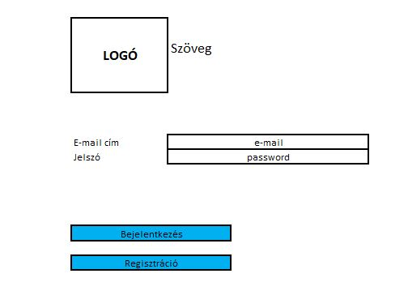
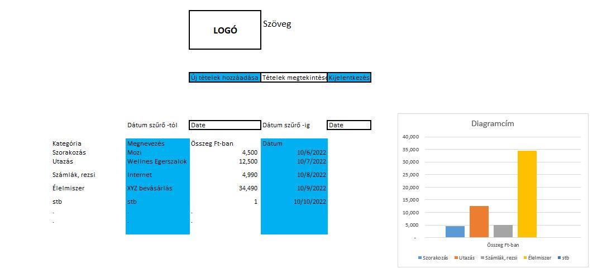
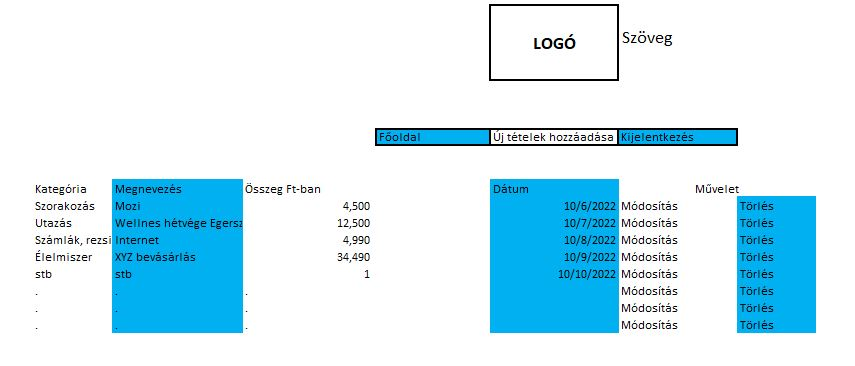
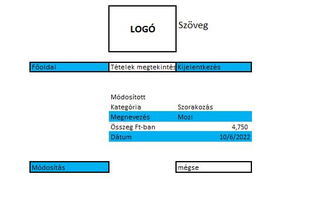
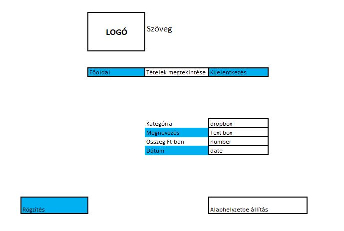

# Funkcionális Specifikáció

## 2. Jelenlegi helyzet

A mai piaci helyzetben úgy érezhetjük, hogy folyik ki a kezeink közül a pénz. A drágulások mértéke és frekvenciája egyre súlyosabb és meredekebb. A fiatalabb korosztály nem minden esetben érzi át annak a súlyosságát, hogy valójában mennyit is költ egy adott időszakban. Ezt jelen pillanatban, egyedül csak a banki aplikációk tudják kimutatni, de egy plusz bankszámlát, ami ilyen funkciókkal rendelkezik nem minden család tud magának megengedni a havi kiadások miatt és emellett a bankkártyák segítségével akár plusz kiadást is tudnak generálni a fiatalok, mert nem felelősségteljesek.

## 10. Képernyő tervek

###### Bejelentkezés

###### Regisztráció

###### Főoldal

###### Tételek

###### Módosítás

###### Új tétel
