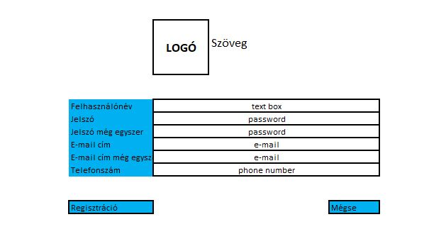

# Funkcionális Specifikáció

## 1. A rendszer céljai és nem céljai
A fejlesztés célja egy költésmenedzsementet megvalósító rendszer készítése magánszemély felhasználók, tehát akár saját magunk részére, mely segítik átlátni költéseinket azáltal, hogy az összes költésünk fel tudjuk rögzíteni egy adatbázisba különböző ismérvek, tulajdonságok szerint, majd ezen listát mindezek, ill. időrend alapján fel tudjuk dolgozni, szűrni.
Annak érdekében, hogy a felhasználónak minél könnyebb legyen az átállás ezen digitális költségkövetésre, hasonlóan felhasználóbarátként, és gyorsan kell működnie a megvalósított informatikai rendszerünknek, mintha még mindig a “kockás füzetbe” vezetné a költségeit, Ill. már persze rengeteg banki alkalmazás próbál segíteni ebben.
Már az is haladás, visszaolvassuk, mikor, mire, mennyit költöttünk, mivel minden hónapban iszonyatosan sok apró pénzügyi tranzakciónk van, melyeket képtelenség észben tartani.
A rendszer különböző szintű jogosultságot képes kezelni (admin és felhasználó), így az egyes jogosultságokhoz tartozó műveletek is eltérőek.
Meg kell valósítani a felrögzített költségek adatbázisát, melynek kereshetőnek (indexálhatónak), valamint bővíthetőnek kell lennie.
A felhasználók lesznek a rendszerben többségben, ők végzik a költség listája karbantartását, a költéseik adminisztrációját, ezért fontos, hogy az általuk használt funkciók ergonómiája minél jobb legyen, a lehető legjobban támogassa a programunk hatékony kezelését.

A fejlesztés első ütemében a fő funkciók (felhasználók regisztrációja és kezelése, kategóriák kialakítása, költések nyilvántartása, költéshez kapcsolódó műveletek kezelése, listázás) megbízható működésének megvalósítása a célja, de nem cél a rendszer tágabban vett pénzmenedzsmentre történő felkészítése, mint pl. kamatok, megtakarítások és bevételek kezelése.

## 2. Jelenlegi helyzet

A mai piaci helyzetben úgy érezhetjük, hogy folyik ki a kezeink közül a pénz. A drágulások mértéke és frekvenciája egyre súlyosabb és meredekebb. A fiatalabb korosztály nem minden esetben érzi át annak a súlyosságát, hogy valójában mennyit is költ egy adott időszakban. Ezt jelen pillanatban, egyedül csak a banki aplikációk tudják kimutatni, de egy plusz bankszámlát, ami ilyen funkciókkal rendelkezik nem minden család tud magának megengedni a havi kiadások miatt és emellett a bankkártyák segítségével akár plusz kiadást is tudnak generálni a fiatalok, mert nem felelősségteljesek.

## 3. Vágyálom rendszer leírása

A jelenlegi helyzetben vázoltak miatt azt a lehetőséget látjuk, hogy olyan embereknek is tudunk segíteni, akiknek nem anyagi segítségre van szüksége, hanem a saját anyagi helyzetének a karbantartására van igénye. Ennek a segítsége érdekében különböző grafikai megjelenítés kell, hogy könnyen látható legyen kategóriánként, hogy az egyén megismerje önmagát, a vásárlási szokásait, és lehetőleg abba az irányba terelni, hogy ezeket a szokásokat változtassa meg a tudatos vásárló irányába.

## 10. Képernyő tervek

###### Bejelentkezés

###### Regisztráció

###### Főoldal

###### Tételek

###### Módosítás

###### Új tétel
